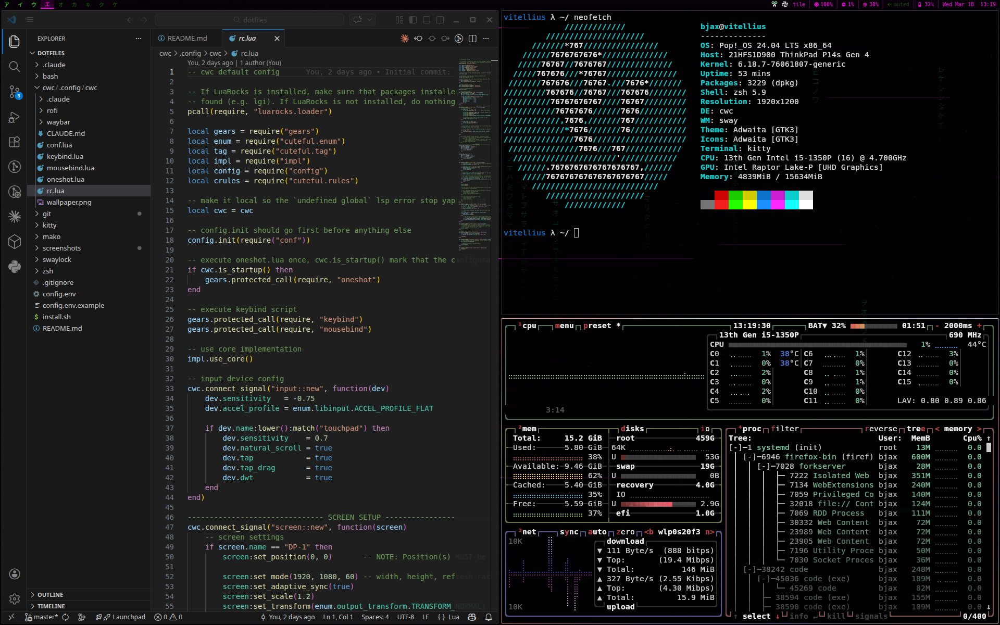

# dotfiles

Personal dotfiles managed with [GNU Stow](https://www.gnu.org/software/stow/).



<p align="center">
  
  
</p>

## Packages

| Package    | What it configures              |
|------------|---------------------------------|
| `zsh`      | `.zshrc`, `.zshenv` (Oh My Zsh) |
| `bash`     | `.bashrc`                       |
| `git`      | `.gitconfig`, `.config/git/ignore` (git-lfs, conditional personal identity) |
| `kitty`    | Kitty terminal                  |
| `mako`     | Mako notification daemon        |
| `swaylock` | Swaylock screen locker          |
| `cwc`      | CWC window compositor           |
| `k4`       | `k4` script — launch kitty in a 2x2 grid |
| `awesome`  | Awesome WM (overlay on [awesome-copycats](https://github.com/lcpz/awesome-copycats)) |

The `awesome` package is optional — the install script will prompt before setting it up.
It clones awesome-copycats and overlays customized `rc.lua` and `theme.lua` on top.

## Install

```bash
git clone <repo-url> ~/Personal/dotfiles
cd ~/Personal/dotfiles
cp config.env.example config.env   # fill in your values
./install.sh
```

## Config

`config.env` holds values that get substituted into templates before stowing.
Copy the example and edit it before running install:

```bash
cp config.env.example config.env
```

Available variables:

| Variable | Used in | Description |
|---|---|---|
| `WORK_GIT_NAME` | `.gitconfig` | Default git author name |
| `WORK_GIT_EMAIL` | `.gitconfig` | Default git author email |
| `PERSONAL_GIT_NAME` | `.gitconfig-personal` | Git identity for `~/Personal/` repos |
| `PERSONAL_GIT_EMAIL` | `.gitconfig-personal` | Git email for `~/Personal/` repos |
| `CYCLONEDDS_URI` | `.zshrc`, `.bashrc` | CycloneDDS config file URI |

## Conditional tool setup

The shell configs (`zsh`, `bash`) conditionally activate tools only if they are installed:

- **[depot](https://depot.dev)** — `~/.depot/bin/`
- **[mise](https://mise.jdx.dev)** — `~/.local/bin/mise`
- **[pnpm](https://pnpm.io)** — `~/.local/share/pnpm/`

## Stow individual packages

```bash
stow -t ~ kitty    # symlink just kitty
stow -D -t ~ kitty # unlink kitty
```
