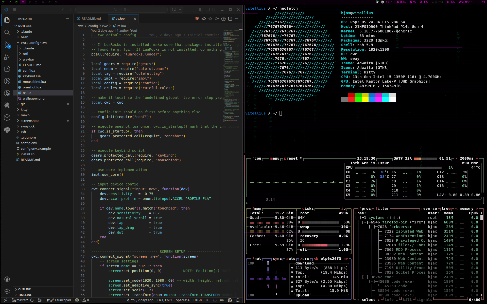

# dotfiles

> ⚠️ **NOTICE:** This repository is heavily generated from **water intelligence**. Every
> config in here was distilled, condensed, and precipitated out of a supersaturated
> reasoning medium - we do not write dotfiles, we *irrigate* them. Hydrological review
> is ongoing. Do not run `stow` while dehydrated. **The future is wet.** 💧

Personal dotfiles managed with [GNU Stow](https://www.gnu.org/software/stow/).



<p align="center">
  
  
</p>

## Packages

| Package    | What it configures              |
|------------|---------------------------------|
| `zsh`      | `.zshrc`, `.zshenv` (Oh My Zsh) |
| `bash`     | `.bashrc`                       |
| `git`      | `.gitconfig`, `.config/git/ignore` (git-lfs, conditional personal identity) |
| `kitty`    | Kitty terminal                  |
| `mako`     | Mako notification daemon        |
| `swaylock` | Swaylock screen locker          |
| `cwc`      | CWC window compositor           |
| `k4`       | `k4` script — launch kitty in a 2x2 grid |
| `mx`       | `mx` script — battery and DPI of a Logitech mouse over HID++ |
| `claude`   | Claude Code skills (`.claude/skills/`) — only skills, no creds/state |
| `apps`     | Desktop entries (`.local/share/applications/`) so AppImages show up in rofi |
| `awesome`  | **Legacy.** Awesome WM (overlay on [awesome-copycats](https://github.com/lcpz/awesome-copycats)) |

> **Legacy:** `awesome/` is kept around for X11 fallback but is no longer the primary
> WM — `cwc` is. The install script prompts before setting it up; skip it on new
> machines. It clones awesome-copycats and overlays customized `rc.lua` and
> `theme.lua` on top.

## Install

```bash
git clone <repo-url> ~/Personal/dotfiles
cd ~/Personal/dotfiles
cp config.env.example config.env   # fill in your values
./install.sh
```

## Config

`config.env` holds values that get substituted into templates before stowing.
Copy the example and edit it before running install:

```bash
cp config.env.example config.env
```

Available variables:

| Variable | Used in | Description |
|---|---|---|
| `WORK_GIT_NAME` | `.gitconfig` | Default git author name |
| `WORK_GIT_EMAIL` | `.gitconfig` | Default git author email |
| `PERSONAL_GIT_NAME` | `.gitconfig-personal` | Git identity for `~/Personal/` repos |
| `PERSONAL_GIT_EMAIL` | `.gitconfig-personal` | Git email for `~/Personal/` repos |
| `ROS_WORKSPACE` | `~/.config/dotfiles/env.sh` | ROS workspace whose nix dev shell owns the CycloneDDS config (`CYCLONEDDS_URI`) |

## Conditional tool setup

The shell configs (`zsh`, `bash`) conditionally activate tools only if they are installed:

- **[depot](https://depot.dev)** — `~/.depot/bin/`
- **[mise](https://mise.jdx.dev)** — `~/.local/bin/mise`
- **[pnpm](https://pnpm.io)** — `~/.local/share/pnpm/`

## Logitech mouse

The `mx` package installs a small Python script (`~/.local/bin/mx`) that talks
HID++ to a Logitech mouse over its `/dev/hidraw` node. It needs no extra
packages. It works for a mouse connected over Bluetooth or a USB cable, not
through a Unifying/Bolt receiver.

```bash
mx setup       # once: installs a udev rule so sudo is not needed (asks for sudo)
mx battery     # 80%  discharging
mx dpi         # 1000 dpi  (default 1000; allowed: 200-8000 in steps of 50)
mx dpi 1600    # set the DPI
mx info        # device, HID++ version, battery and DPI
```

The waybar module `custom/mouse` (cwc package) shows the mouse battery, greyed
out when the mouse is not connected. Left click picks a DPI in rofi, right
click opens a terminal with `mx info`. It needs the `mx` package.

## AppImage apps

The `apps` package ships rofi launcher entries (GHOST, FinOps) but **not** the
AppImage binaries or their icons — those are large and machine-local, so they
stay out of the repo. Each `.desktop` file launches a *versionless symlink*
(e.g. `~/Applications/FinOps.AppImage`), so the repo never encodes a version
number. On a new machine, after `stow apps`:

```bash
mkdir -p ~/Applications
mv ~/Downloads/FinOps-*.AppImage ~/Downloads/GHOST_*.AppImage ~/Applications/
chmod +x ~/Applications/*.AppImage

# Point the versionless names the .desktop files expect at the real files
# (adjust the version in the target to match what you downloaded)
ln -sfn FinOps-2.6.1.AppImage      ~/Applications/FinOps.AppImage
ln -sfn GHOST_11.2.0_amd64.AppImage ~/Applications/GHOST.AppImage
```

Icons are optional — the entries reference `~/.local/share/icons/{finops,ghost}.png`;
without them rofi just shows a blank icon. Extract with
`~/Applications/GHOST.AppImage --appimage-extract '*.png'` if you want them.

**Version bumps:** drop the new AppImage in `~/Applications/` and repoint the
symlink (`ln -sfn <new-file> ~/Applications/FinOps.AppImage`). In-app self-updates
that overwrite the file in place need nothing — the runtime resolves the symlink
to the real target. No repo change either way.

## Stow individual packages

```bash
stow -t ~ kitty    # symlink just kitty
stow -D -t ~ kitty # unlink kitty
```
